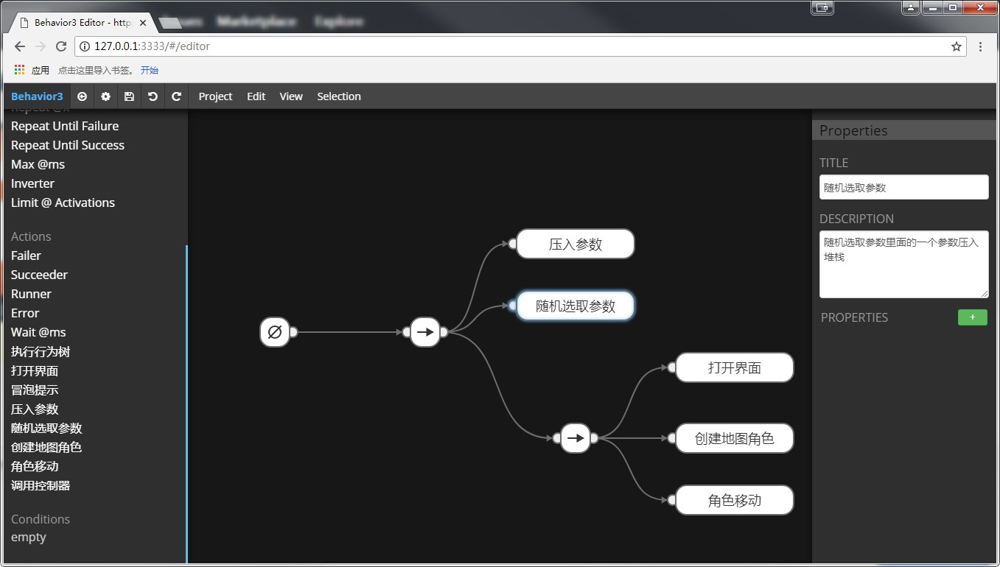

# behavior3-reduce
使用pomelo-protobuf来压缩behavior3生成的json文件，大幅度减少树文件的体积.
# 编辑器
修改了编辑器导出接口，点击导出bin按钮就会生成压缩后的bin文件，编辑器只能使用谷歌浏览器才能正常使用
# behavior库
修改了behavior库的导入数据接口在libs\behavior3js.js，带了个d.ts方便代码提示
# 使用
> git clone https://github.com/alexviolent/behavior3-reduce.git
> cd b3editor
> npm install mdserver -g
> mdserver
========================
> 然后打开谷歌浏览器进入http://127.0.0.1:3333即可打开编辑器 
> 菜单依次 Project>Export>Project as JSON 可以看到Save as bin按钮，这里是浏览器，点击了也保存不了文件
> 所以想导出文件，需要使用nodewebkit把编辑器打包成exe，怎么使用自行百度
> nodewebkit官网nwjs(http://nwjs.io/)

=========================

